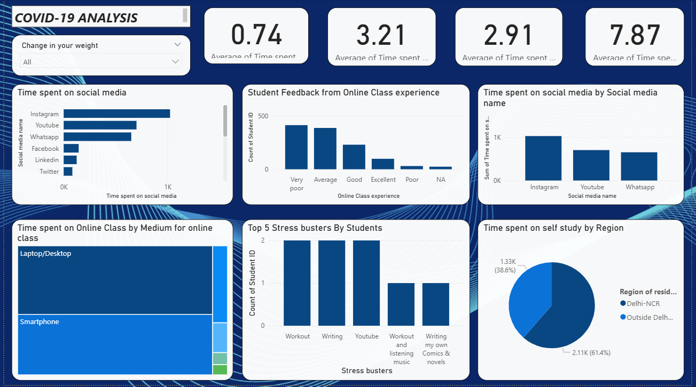
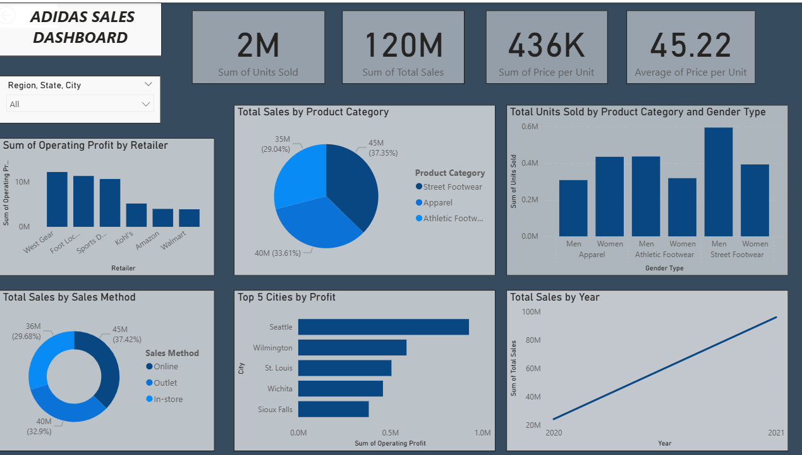

# 📊 Power BI Multi-Dashboard Business Analytics Project

## 📌 Project Overview
This Power BI project consists of **5 interactive dashboards** analyzing different real-world business and public datasets.  
The dashboards provide actionable insights using KPIs, trends, comparisons, and interactive visuals to support data-driven decision-making.

## 🛠 Tools & Technologies
- Power BI Desktop
- DAX
- Power Query
- Excel / CSV Datasets
- Data Modeling & Visualization

---

## 📊 Dashboards Included

### 1️⃣ Pizza Sales Analysis Dashboard
**Objective:** Analyze pizza sales performance and customer ordering patterns.

**Key Insights:**
- Total revenue, total orders, and average order value
- Best-selling and least-selling pizza categories
- Sales distribution by size and category
- Daily and monthly sales trends

🖼️ *Dashboard Preview:*  

---

### 2️⃣ COVID-19 Analysis Dashboard
**Objective:** Visualize the spread and impact of COVID-19 across regions.

**Key Insights:**
- Total confirmed cases, deaths, and recoveries
- Country/region-wise comparison
- Trend analysis over time
- Impact assessment using interactive filters

🖼️ *Dashboard Preview:*  

---

### 3️⃣ UK Road Accident Analysis Dashboard
**Objective:** Analyze road accident patterns in the UK to identify risk factors.

**Key Insights:**
- Total accidents and casualty counts
- Accident severity analysis
- Impact of weather, road type, and lighting conditions
- Yearly and location-based accident trends

🖼️ *Dashboard Preview:*  

---

### 4️⃣ Adidas Sales Dashboard
**Objective:** Evaluate Adidas sales performance across products and regions.

**Key Insights:**
- Total sales, profit, and quantity sold
- Product category and region-wise performance
- Monthly and yearly sales trends
- Top-performing and underperforming products

🖼️ *Dashboard Preview:*  

---

### 5️⃣ InnovateHR Dashboard
**Objective:** Analyze HR metrics to support workforce planning and performance evaluation.

**Key Insights:**
- Employee count, attrition rate, and average tenure
- Department-wise employee distribution
- Gender and age diversity analysis
- Attrition trends and performance insights

🖼️ *Dashboard Preview:*  

---

## 🚀 How to Use
1. Download the `.pbix` file from this repository
2. Open it in **Power BI Desktop**
3. Refresh the data if required
4. Use slicers and filters to explore insights

---

## 🎯 Key Learnings
- End-to-end data analysis using Power BI
- Data cleaning and transformation with Power Query
- KPI creation and advanced calculations using DAX
- Building interactive and business-focused dashboards

---

## 📎 Project File
- `PowerBI Dashboards.pbix`

